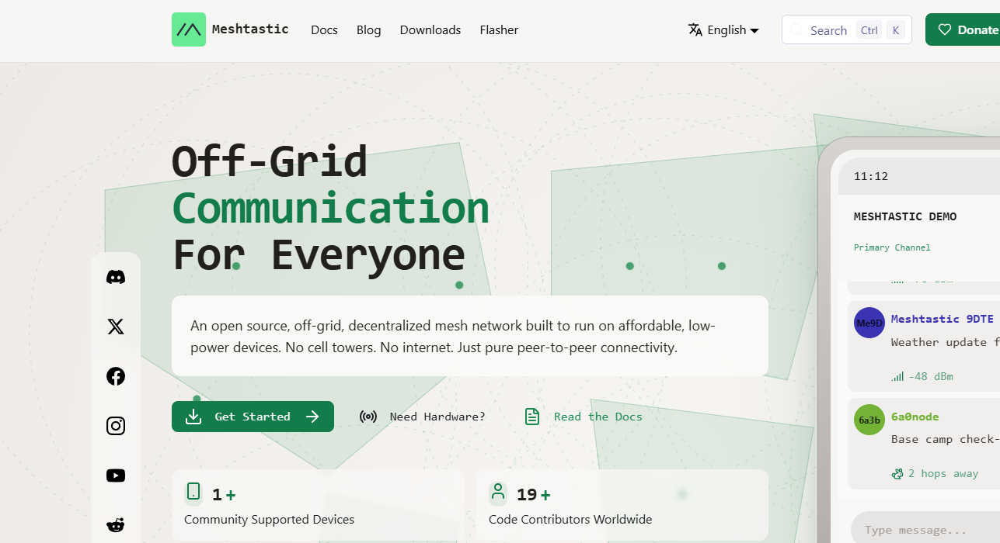
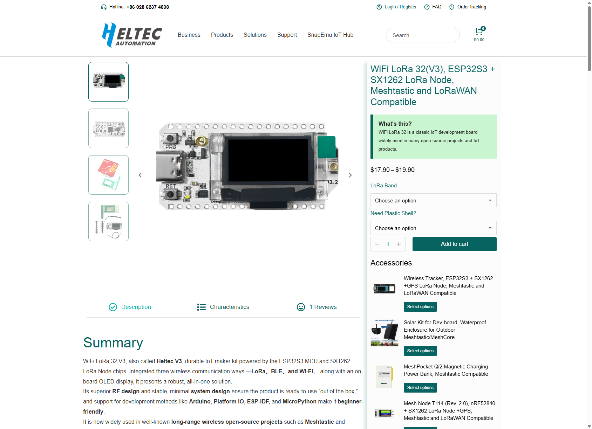
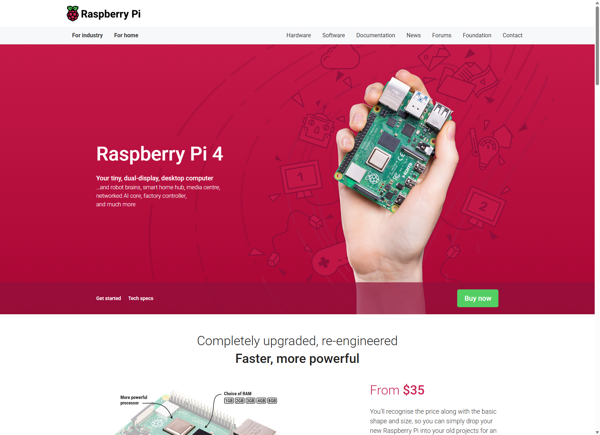

# h-mesh

[Meshtastic](https://meshtastic.org/)-based design for a multi-site mesh deployment with internet-assisted site bridging, logging, and controlled automation.

<p align="center">
  
  
  
</p>

Illustrative imagery in this repository is derived from the official Meshtastic, Heltec, and Raspberry Pi project and product pages.

## Design Overview

This design describes a [Meshtastic](https://meshtastic.org/) deployment that links separate physical [LoRa](https://www.semtech.com/lora) coverage areas through an internet backhaul while preserving local radio-first operation at each site.

The baseline model uses a Raspberry Pi and a USB-connected Heltec radio as the gateway at each fixed site. These gateway hosts handle bridge policy, logging, queueing, and controlled automation boundaries while the radios provide local RF access.

## Problem Statement

Many operating areas have strong local needs for off-grid communication but are split across multiple properties or work zones that cannot reach each other over [LoRa](https://www.semtech.com/lora) alone.

Field teams, equipment, and sensors need:

- local communication beyond Wi-Fi coverage
- inter-site communication when sites have internet but not RF line of sight
- GPS-aware node reporting for locating people and assets
- separation between chat, telemetry, and automation traffic
- a controlled path for machine actions such as supervised relay or contactor control

## Solution Design

The proposed solution combines:

- one local [Meshtastic](https://meshtastic.org/) mesh per site
- one Pi-assisted gateway per fixed site
- a private [MQTT](https://mqtt.org/) backbone for inter-site transport, where MQTT is a lightweight publish/subscribe messaging protocol commonly used in IoT systems
- per-channel policy for `ops`, `sensor`, and `control` traffic
- private deployment configuration separated from versioned examples and templates

## Documentation

- [Overview](docs/overview.md)
- [Architecture](docs/architecture.md)
- [Gateway Service Design](docs/gateway-service-design.md)
- [Gateway Acceptance Test Plan](docs/gateway-acceptance-tests.md)
- [Transport Constraints](docs/transport-constraints.md)
- [Application Protocol](docs/application-protocol.md)
- [Sensor And Control Schemas](docs/sensor-control-schemas.md)
- [Payload Transfer Decision](docs/payload-transfer-decision.md)
- [Position Persistence](docs/position-persistence.md)
- [Telemetry And Alerting](docs/telemetry-alerting.md)
- [Requirements Use Cases](docs/requirements-use-cases.md)
- [Naming And Configuration](docs/naming-and-configuration.md)
- [Gateway Components](docs/component-gateway.md)
- [Radio Components](docs/component-radio.md)
- [Sensor Components](docs/component-sensor.md)
- [Cloud Components](docs/component-cloud.md)
- [Private Configuration](docs/private-configuration.md)

## Gateway Scaffold

The repository now includes a Phase 1 Python gateway service scaffold under `src/h_mesh_gateway` plus a local Docker [MQTT](https://mqtt.org/) lab broker.

Local lab broker:

```powershell
docker compose -f docker-compose.lab.yml up -d
```

Config validation:

```powershell
$env:PYTHONPATH = "src"
python -m h_mesh_gateway validate-config --env config/examples/site.lab.env.example --json
```

Skeleton startup:

```powershell
$env:PYTHONPATH = "src"
python -m h_mesh_gateway run-skeleton --env config/examples/site.lab.env.example --json
```

Initialize the SQLite schema explicitly:

```powershell
$env:PYTHONPATH = "src"
python -m h_mesh_gateway init-db --env config/examples/site.lab.env.example --json
```

Simulate RF input flowing to MQTT through the real gateway package:

```powershell
$env:PYTHONPATH = "src"
python -m h_mesh_gateway simulate-rf-to-mqtt --env config/examples/ag01.pi-sim.env.example --payload-file docker/integration/fixtures/ops-broadcast.json --json
```

Simulate MQTT delivery back out through a file-backed radio adapter:

```powershell
$env:PYTHONPATH = "src"
python -m h_mesh_gateway simulate-mqtt-to-radio --env config/examples/bg02.pi-sim.env.example --topic mesh/v1/site-a/ops/up --radio-output tmp/bg02-radio-out.json --json
```

Publish a health snapshot on the documented gateway state topic:

```powershell
$env:PYTHONPATH = "src"
python -m h_mesh_gateway publish-health --env config/examples/ag01.pi-sim.env.example --json
```

This scaffold now initializes the Phase 1 SQLite schema for `message_events`, `gateway_observations`, `outbound_queue`, and `dedupe_cache`, adds queue-state helpers for replay-safe bridge behavior, includes a real MQTT adapter seam plus simulated radio interfaces for early lab testing, and publishes `gateway_state` snapshots on the documented MQTT topic layout.

## Docker Integration Harness

The Docker harness in [docker-compose.pi-mqtt-pi.yml](docker-compose.pi-mqtt-pi.yml) now runs the actual gateway package on both endpoints and includes a health-topic observer:

- `ag01` reads a fixture as simulated RF input and publishes it over [MQTT](https://mqtt.org/)
- `bg02` subscribes to the topic and emits the received payload through a simulated radio output file
- `ag01-health-watch` observes the `gateway_state` topic so the harness can assert health transitions on the broker
- Mosquitto provides the broker in the middle

Bring up the harness directly:

```powershell
docker compose -f docker-compose.pi-mqtt-pi.yml up --build --abort-on-container-exit --exit-code-from bg02
```
Run the gated Python integration test:

```powershell
$env:RUN_DOCKER_INTEGRATION = "1"
python -m unittest tests.test_pi_mqtt_pi_docker
```

The Docker daemon must be running for this integration test. If Docker is installed but the daemon is unavailable, the test skips rather than failing the full local suite.
