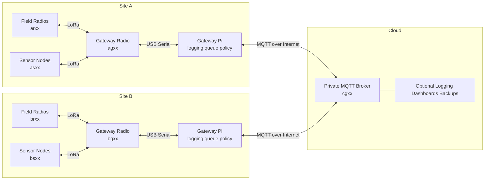

# Architecture

## System Context

The system consists of one or more independent local [Meshtastic](https://meshtastic.org/) meshes connected by an internet backbone.

- Each physical site has local radios and sensors.
- Each fixed site has one Raspberry Pi-assisted gateway pair composed of a Pi and a USB-connected Heltec ESP32 V3.
- A private [MQTT](https://mqtt.org/) broker provides inter-site backhaul. MQTT is a lightweight publish/subscribe messaging protocol that fits low-bandwidth, distributed device communication.
- Optional cloud services provide centralized logging, dashboards, backups, and management tooling.

## Diagram

## Reference Hardware

  
  

The reference fixed-site gateway pairs a Raspberry Pi host with a Heltec ESP32 V3 radio. [Meshtastic](https://meshtastic.org/) provides the RF mesh behavior while the Pi hosts queueing, logging, and bridge policy.

## Logical Flow

1. A local node transmits over [LoRa](https://www.semtech.com/lora) on the relevant site mesh.
2. The site gateway radio receives the packet.
3. The attached Raspberry Pi classifies the packet by channel, origin, and policy.
4. If the packet is approved for inter-site forwarding, the Pi publishes it to the private MQTT broker.
5. Remote site gateways subscribe to the broker, apply local policy, and inject approved traffic into their local mesh.
6. If the WAN path is unavailable, the Pi queues eligible inter-site traffic for later replay.

## Site Layout

Each fixed site contains these major elements:

- RF nodes: handheld, vehicle, equipment, sensor, and fixed radios
- Gateway radio: fixed [Meshtastic](https://meshtastic.org/) radio with stable power and antenna placement
- Gateway host: Raspberry Pi responsible for logging, queueing, and bridge policy
- Local LAN/Wi-Fi: path from the Pi to the internet backbone

## Functional Boundaries

### Meshtastic Radio

- Participates in the local [LoRa](https://www.semtech.com/lora) mesh
- Transmits and receives site traffic
- Exposes a serial interface to the gateway host
- Maintains the on-air channel configuration required for its role

### Gateway Pi

- Maintains a serial link to the local gateway radio
- Logs packets, node updates, and position data
- Applies per-channel forwarding policy
- Queues outbound inter-site traffic when WAN is unavailable
- Replays queued traffic after broker connectivity is restored
- Provides a controlled boundary between mesh traffic and any automation outputs

### MQTT Backbone

- Moves selected messages between sites
- Decouples site availability from cloud availability
- Allows future addition of cloud-side consumers, dashboards, and audit services
- May be hosted on IPv4, IPv6, or dual-stack infrastructure because the Pi-to-broker path is normal IP networking

### IPv6 Boundary

- IPv6 is relevant on the Raspberry Pi to broker path, not on the Meshtastic RF mesh itself
- A broker hosted on AWS with IPv6 reachability is compatible with this design as long as the site gateway Pi has working IPv6 internet access
- Broker address family is an infrastructure choice and does not change the Meshtastic packet format or radio behavior

## Channel Separation

### Ops

- Human-to-human communication
- Direct messages and group traffic
- Highest priority for usability

### Sensor

- Telemetry and status messages
- Lower priority than human communication
- Good candidate for aggregation and rate limiting on the Pi

### Control

- Automation requests and acknowledgements
- Strictly filtered and logged
- Must not directly energize high-current hardware without host-side validation

## Reliability Model

- Local RF operation continues even if WAN is lost.
- Inter-site forwarding pauses when the broker or WAN path is unavailable.
- Gateway Pi hosts persist queued inter-site traffic for later replay.
- Queueing policy should prefer bounded retention over unbounded growth.

## Gateway Degraded Modes

The gateway host must distinguish between broker availability and radio availability.

### Broker Available, Radio Available

- normal publish and subscribe behavior
- inbound MQTT traffic may be injected into the local mesh

### Broker Available, Radio Missing Or Unhealthy

- outbound locally originated inter-site traffic may still be logged and optionally published if policy allows
- inbound MQTT traffic intended for local RF reinjection must not be silently consumed and discarded
- the preferred default behavior is to pause or unsubscribe from site-bound MQTT relay topics until the USB radio is restored
- local queueing for inbound MQTT traffic should only be enabled if the gateway service implements bounded durable storage, replay rules, expiry, and duplicate suppression

This keeps the broker from appearing healthy while the site is actually unable to radiate traffic.

## Lab Validation

When multiple logical sites are tested in close physical proximity, RF isolation must be treated as part of the design.

- Site A and Site B should not be assumed separate just because their gateways use different MQTT topics
- if nearby radios can hear each other over LoRa, accidental local coupling can occur and invalidate site-to-site test results
- lab testing should use separate channel credentials for each logical site and should prefer only one active gateway radio at a time during relay validation
- a practical bench method is to leave Site A's radio attached and Site B's gateway host online without a radio, then swap the attached radio to validate queued or broker-mediated relay behavior without local RF crossover
- successful relay testing means cross-site transfer stops when MQTT is disabled and does not depend on direct local RF reachability between the two logical sites

## Security Model

- Live credentials and keys are private deployment data.
- Versioned content includes schemas, templates, and examples only.
- Control traffic is subject to stricter policy than chat or telemetry traffic.
- Cloud and site services use separate credentials and should support credential rotation.

## Example Deployment

- Site A fixed gateway: `ag01`
- Site B fixed gateway: `bg02`
- Site A handheld radio: `ar10`
- Site B equipment radio: `br11`
- Site A sensor node: `as20`
- Cloud MQTT broker service: `cgf0`

The serial suffix remains globally unique across the fleet.
